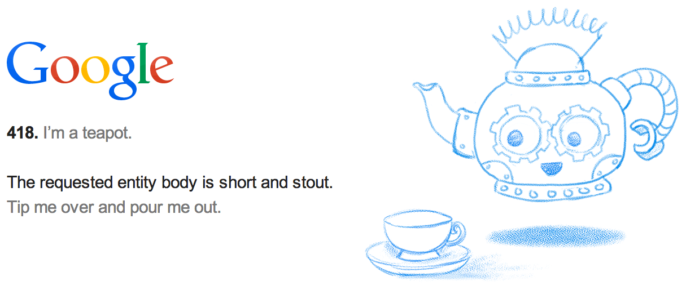
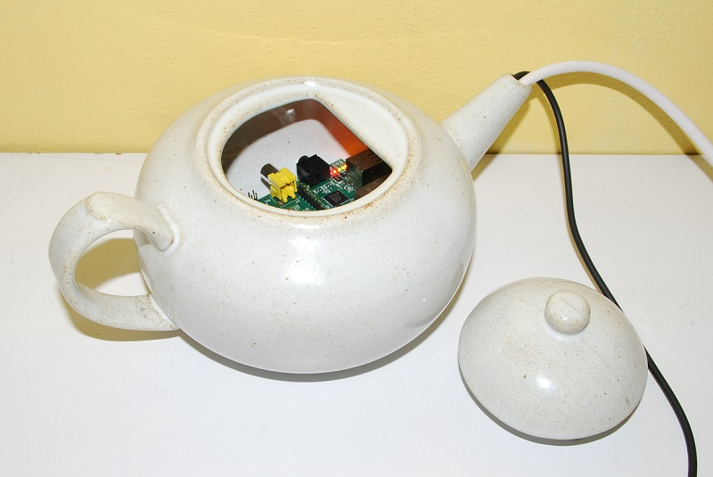
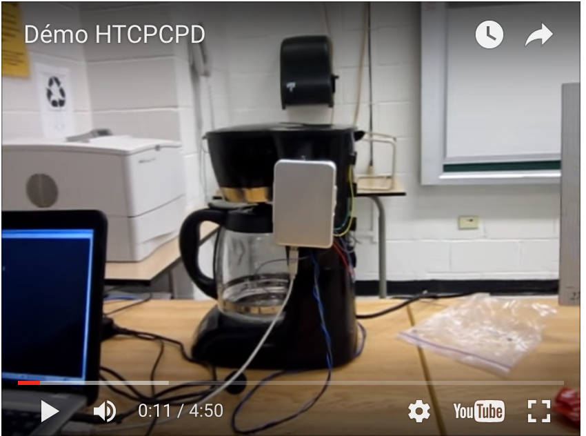

# HTTP status code 418 : I'm a teapot


## 1. HTTP 상태 코드
이제 인터넷은 우리 생활에 녹아들어 시간과 장소에 구애 받지 않고 사람과 사람, 사람과 정보를 연결 해 주고 있다.

이런 인터넷 상의 정보에 접근하는 것은 마치 우리가 누군가와 전화통화를 하는 과정과 이슷하게 생각 할 수 있다. 먼저 우리가 누군가와 전화 통화를 하려면, 받는 사람의 전화번호를 알아야 한다. 마찬가지로 인터넷의 정보에 접근하기 위해서는 이 정보가 위치하고 있는 곳의 주소(URL)이 필요하다. 자, 이제 수화기를 들고 전화번호를 누른다. 전화를 받는 사람의 번호를 올바르게 입력했다면 머지않아 벨 소리가 들릴 것이고, 상대방이 전화를 받았을 때 딸깍 하는 소리와 함께 통화가 시작된다. 이렇게 전화를 발신하고, 상대방이 받을 때까지 수신대기하고, 상대방이 받은 경우 실데 통화상태로 변경하여 목소리를 전달하기 시작하는 과정으로 전화 를 거는 행위를 정리 할 수 있다.

인터넷에서 정보를 가져오는 과정 또한 이와 비슷하게, 요청한 URL에 정보가 존재하는지 확인하고, 연결이 되엇다면 데이터를 전송받고, 전송이 성공 한 경우 전송성공 메세지와 함께 사용자에게 전송받은 정보를 보여주기 시작한다. 우리가 전화를 걸 때에도 '벨소리가 들리면 통화 대기중' 이라고 암묵적으로 약속이 되어 있을 것이다. 마찬가지로 인터넷을 이용하여 정보를 전달 할 때에도 정보의 전송방법 및 전송상태에 대한 약속들이 필요 할 것이다.

## 2. I'm teapot

앞서 이야기 한 바와 같이 원격지에 있는 누군가와 통신을 할 때에는 통신 상태에 대한 정의가 필요한데, 이를 IETF에서는 [RFCs(Request for Comment)의 상태코드](http://www.iana.org/assignments/http-status-codes/)로 표준을 정의 해 놓았다. 그런데 [HTTP 상태 코드](https://en.wikipedia.org/wiki/List_of_HTTP_status_codes) 목록을 한번이라도 자세히 읽어 본 적이 있다면, 조금 특이한 의미 오류 코드를 발견 할 수 있다.

### HTTP 상태 코드 418

>**[418 I'm a teapot (RFC 2324)](https://en.wikipedia.org/wiki/List_of_HTTP_status_codes#4xx_Client_Error)**
> This code was defined in 1998 as one of the traditional IETF April Fools' jokes, in RFC 2324, Hyper Text Coffee Pot Control Protocol, and is not expected to be implemented by actual HTTP servers. The RFC specifies this code should be returned by tea pots requested to brew coffee. This HTTP status is used as an easter egg in some websites, including Google.com.

1998년 국제 인터넷 표준화 기구(IETF, Internet Engineering Task Force)의 만우절 농잠으로 시작됫으며 실제로 [RFC 2324](https://tools.ietf.org/html/rfc2324)에  하이퍼텍스트 커피포트 제어규약(HTCPCP, Hyper Text Coffee Pot Control Protocol)으로 정의됫다고 한다. 이 규약은 실제로 HTTP를 이용하여 커피를 끓이는 찻주전자의 상태를 서비스하는 서버의 구현을 염두 해 주고 정의되었다. 물론 [HTTP 1.1 표준문서](https://tools.ietf.org/html/rfc7231)에는 정식으로 포함되지 않았으나, IETF의 표준규약에는 아래와 같이 실제 HTCPCP의 RFC 문서가 존재하고 있다.


### IETF가 표준문서에 장난을?
IETF, 국제 인터넷 표준화 기구는 인터넷의 운영, 관리, 개발에 대해 협의하고 프로토콜과 구조적인 사안들을 분석하는 인터넷 표준화 작업을 하는 국제기구이다. 이렇게 중요한 역할을 담당하는 국제기구가 국제표준으로 장난섞인 농담을 한다는 것은 쉽사리 상상이 되지 않는다.


그렇다. 실제로 IETF가 RFC를 가지고 농담을 하고 있으며, 이는 오늘 내일의 문제가 아니다. 게다가 커피포트 제어 프로토콜 뿐만이 아닌 꽤 많은 수의 만우절 장난으로 발표한 문서가 있음을 알수 있다. 심지어 이에 대해서 위키피디아에는 [만우절 RFC](https://en.wikipedia.org/wiki/April_Fools%27_Day_Request_for_Comments)라는 항목이 실제로 존재하고 있다.

>A Request for Comments (RFC) is a type of publication from the Internet Engineering Task Force (IETF) and the Internet Society (ISOC), usually describing methods, behaviors, research, or innovations applicable to the working of the Internet and Internet-connected systems.
>
>Almost every April Fools' Day (1 April) since 1989, the Internet RFC Editor has published one or more humorous Request for Comments (RFC) documents, following in the path blazed by the June 1973 RFC 527 called ARPAWOCKY, a parody of Lewis Carroll's nonsense poem "Jabberwocky". [The following list](https://en.wikipedia.org/wiki/April_Fools%27_Day_Request_for_Comments) also includes humorous RFCs published on other dates.

## 3. HTCPCP의 구성
찻주전자로 커피를 끓이기 위한 통신규약인 HTCPCP는 IETF [RFC 2324](https://tools.ietf.org/html/rfc2324)에 정의되어 있으며, HTTP 통신을 기반으로 Method / Header / URI-scheme 등이 추가로 구성되어 있다.

HTCPCP의 표준문서의 각 항목이 어떨게 구성되었는지 자세히 살펴보자. HTCPCP 표준 문서는 양이 많지 않은 편이므로, 아래에서는 각 정의 항목을 하나하나 살펴 보고자 한다.

### Method

- **```BREW``` 또는 ```POST``` 메소드**
   - 커피를 끓이기 위한 메소드 이며, Content-Type으로 ```application/coffee-pot-command```을 가진다.
   - 커피포트 서버에서는 BREW와 POST를 모두 지원해야 하며, POST를 통한 제어는 지양(deprecated)해야 한다.
   - 커피포트는 전열기기로 불(fire)을 사용하지 않으니 네트워크 방화벽(firewall)구성 및 제어를 필요로 하지 않는다.
   - POST 메소드는 커피의 상표를 서비스 하는 용도로 사용 할 수 있다.
   - BREW 메소드는 추가로 제공되는 메소드이며, 다른 HTTP프로토콜에서도 사용 될 수 있다.
      (예를 들면, Hyper Text Brewery Control Protocol 같은..)

- **```GET``` 메소드**
   - 커피포트에 대한 정보를 반환한다.
   - 커피에 대한 정보가 없는 이유는 대부분의 커피 URI가 카페인을 포함하지 않기 때문이다.

- **```PROPFIND``` 메소드**
   - 커피에 대한 메타데이터를 제공한다.

- **```WHEN``` 메소드**
   - 커피를 따른 다음 우유를 추가로 따를 경우, 언제(when) 우유를 따르는 것을 멈출것인지에 대한 명령이다.
   - 커피에 우유가 충분히 따라 진 경우 WHEN메소드를 호출하여 우유 따르는 동작을 중지 할 수 있다.

### Header

- 'safe' 응답 헤더 (recommended)
   실제로 커피를 끓여내는 과정에는 다양한 위험 요소가 존재한다. 커피포트 서버에서는 이러한 위험요소들을 식별해서 사용자에게 위험요소를 알릴 수 있다.
   커피포트의 헤더에 추가되는 안전한 상태에 대한 정보는 아래와 같은 형식으로 제공되며, 별도의 POST 명령을 구현하여 사용자가 더 편리하게 인지할 수 있는 방법으로 위험요소를 알릴 수 도 있다.

```
 Safe                = "Safe" ":" safe-nature
 safe-nature         = "yes" | "no" | conditionally-safe
 conditionally-safe  = "if-" safe-condition
 safe-condition      = "user-awake" | token
```

- 'Accept-Additions' 헤더
   'Accept-Additions'는 커피포트 서버에서는 요청헤더에 사용가능한 미디어타입을 알리기 위해 사용한다. 이 때 사용가능한 미디어타입이란 설탕/시럽의 포함여부, 우유의 종류 등등 커피를 끓이는데 있어서 취할 수 있는 부가적인 작업들을 말한다.

```
Accept-Additions = "Accept-Additions" ":"
              #( addition-range [ accept-params ] )

addition-type   = ( "*"
              | milk-type
              | syrup-type
              | sweetener-type
              | spice-type
              | alcohol-type
              ) *( ";" parameter )
milk-type       = ( "Cream" | "Half-and-half" | "Whole-milk"
              | "Part-Skim" | "Skim" | "Non-Dairy" )
syrup-type      = ( "Vanilla" | "Almond" | "Raspberry"
              | "Chocolate" )
alcohol-type    = ( "Whisky" | "Rum" | "Kahlua" | "Aquavit" )
```

### Status Code

- 406 Not Acceptable
   406 Not Acceptable 헤더는 일반적으로 '요청한 헤더에 정의된 컨텐츠의 특성이 실제 리소스에 적용될 수 없거나 처리될 수 없음'을 의미한다.
   HTCPCP에서는 Accept-Additions 헤더를 통한 요청을 처리 할 수 없을 경우에 발생하는 오류코드이다.

- 418 I'm a teapot
   서비스를 제공하는 서버가 커피포트입을 알리는 오류코드. 응답 바디에 [short and stout](https://en.wikipedia.org/wiki/I%27m_a_Little_Teapot)라는 커피포트 노래를 포함 할 수 있다.

### URI Scheme
커피는 세게적인 음료이기 때문에 커피에 대한 URI-scheme 또한 다국어를 지원하고 있다.

URI가 어떤 언어로 표현되든지 모두 동일한 의미를 지닌다. URI가 ANSI문자로 표현 할 수 없는 경우 인코딩 된 문자로 표현한다. URI에 사용된 문자는 대소문자를 구분하지 않는데 독일어 'Kaffee'라는 단어는 K가 대문자로 표현되는 것이 중요하기에 특별히 인코딩 하여 표현하고 있다.

커피URI는 아래와 같은 구조를 가지며, URI에는 커피머신의 접속주소 및 커피포트 번호, 부가옵션 등이 포함될 수 있다.

```
coffee-url  =  coffee-scheme ":" [ "//" 접속주소 ] ["/" 커피포트선택자 ] ["?" 부가정보목록 ]

coffee-scheme = ( "koffie"                      ; Afrikaans, Dutch
              | "q%C3%A6hv%C3%A6"          ; Azerbaijani
              | "%D9%82%D9%87%D9%88%D8%A9" ; Arabic
           | "akeita"                   ; Basque
           | "koffee"                   ; Bengali
           | "kahva"                    ; Bosnian
           | "kafe"                     ; Bulgarian, Czech
           | "caf%C3%E8"                ; Catalan, French, Galician
              | "%E5%92%96%E5%95%A1"       ; Chinese
              | "kava"                     ; Croatian
           | "k%C3%A1va                 ; Czech
   ㄴ        | "kaffe"                    ; Danish, Norwegian, Swedish
           | "coffee"                   ; English
           | "kafo"                     ; Esperanto
              | "kohv"                     ; Estonian
           | "kahvi"                    ; Finnish
           | "%4Baffee"                 ; German
           | "%CE%BA%CE%B1%CF%86%CE%AD" ; Greek
           | "%E0%A4%95%E0%A5%8C%E0%A4%AB%E0%A5%80" ; Hindi
           | "%E3%82%B3%E3%83%BC%E3%83%92%E3%83%BC" ; Japanese
           | "%EC%BB%A4%ED%94%BC"       ; Korean
           | "%D0%BA%D0%BE%D1%84%D0%B5" ; Russian
           | "%E0%B8%81%E0%B8%B2%E0%B9%81%E0%B8%9F" ; Thai
           )

커피포트선택자 = "pot-" 정수  ; 하나의 커피머신 안에 여러개의 커피포트가 존재할 수 있기 때문.
부가정보목록 = #( 부가정보 )
```

### 미디어타입
커피포트의 요청 메세지 중 ```POST```와 ```BREW```는 헤더의 Content-Type에 ```Content-Type = 'message/coffeepot'```과 같이 message/coffeepot 라는 미디어타입을 포함해야 한다.
이 미디어 타입은 요청하는 메소드에 담겨있는 정보의 종류가 커피포트를 제어하기 위한 정보임을 의미한다.

이 message/coffeepot은 커피포트를 제어하기 위한 coffee-message-body라는 헤더만을 가질 수 있으며, 다음과 같이 시작/종료를 알리는 값 만을 허용한다.

```
coffee-message-body = "start" | "stop"
```

### 운영상 제약사항
HTCPCP에는 다음과 같이 커피포트가 유비쿼터스 환경에서 개발되었을 경우 또한 고려하고 있다.

* **타이밍 이슈**
   커피포트를 이용하는 사람과 커피포트 서비스 사이에는 긴밀한 연결이 필요하다.이를 위해 커피포트는 반드시 [NTP(Network Time Protocol)](https://en.wikipedia.org/wiki/Network_Time_Protocol) 를 이용한 글로벌 시간동기화 기능을 지원해야 한다.
   기기를 원격으로 제어하는 일이 쉽지 않은 일임에도 불구하고 케임브리지 대학에서는 [The Trojan Room Coffee Machine](http://www.cl.cam.ac.uk/coffee/coffee.html)이라는 커피포트 서비스를 선보였으며, 이는 [SNMP](https://en.wikipedia.org/wiki/Simple_Network_Management_Protocol)가 아닌 웹을 이용한 방식으로 커피포트를 감시하고(monitoring) 제어(management) 할 수 있는 시스템의 구현 사례라 할 수 있다.
   웹 페이지는 일반적으로 정적(static)이므로 매번 요청 할 필요 없이, 한번 요청한 내용을 웹브라우저에 저장하여 보여주는 방식으로 구현 할 수 있다. 다만 기기의 상태나 제어와 같은 동작은 실시간으로 변하는(dynamic) 값이므로 서버에 접속 할 때마다 그 값을 갱신 해 줄 필요가 있다.

* **방화벽 통과**
   대부분의 HTTP트래픽이 방화벽을 넘는 일은 그다지 어려운 일이 아니다. HTCPCP를 이용하는 커피포트는 반드시 불(fire)을 사용하지 않지만, 커피를 끓이기 위해서는 불이 아니더라도 모종의 열원이 필요할 것이고 이로인한 위험요소를 차단하는데에는 방화벽(firewall)이 유용할 것이다.
   HPCPCP의 방화벽을 이용하는 방법은 크게 어렵지 않은데, 이는 HPCPCP를 이용하는 커피포트가 홈 네트워크 방화벽의 바깥에 존재하는 시스템이며 기존의 HTTP와 같은 포트로 통신을 하기 때문에 기존 방화벽 정책을 재사용 할 수 있다. 물론 HTCPCP에 특화된 몇몇 메소드나 헤더 등을 처리하기위해 방화벽 정책을 업그레이드 할 필요가 있을 수 있지만, 홈 네트워크를 관리하는 사람도 커피를 마시는 사람일 것이기 때문에 커피포트를 위한 방화벽 정책 튜닝에 지원을 아끼지 않을 것이다.

### 시스템 관리를 위한 고려사항
웹을 이용한 커피포트 관리 시스템은 오래전부터 존재해 왔다. 케임브리지 대학의 CAM과 같은 오래된 시스템의 경우 ATM에서 사용하는 방식인 비디오 카메라의 화살을 프레임 그래버(frame-grabber)로 캡쳐해서 웹 상에 이 미지로 서비스 하는 방식으로 구성하고 있었다.
케임브리지 대학 연구실의 Trojan Room 예를 좀더 자세히 보면, Trojan Room 복도에 있는 커피포트를 웹일 이용해서 모니터링 하고 관리하는 서비스를 제공했다. 이 서비스는 케임브리지 대학 컴퓨터 연구소에서 개발한 새로운 RPC 동작방식인 MSRPC2를 사용했는데, 이 방식은 ATM을 위한 네트워크 계층 프로토콜인 MSNL(Multi-Service Network Layer) 에서 동작하는 방식이다.

로컬 네트워크를 넘어 인터넷 환경에서의 커피포트를 관리하고자 할 때에는 커피포트MIB를 이용 할 수 있다. 이 관리 방법은 [Definitions of Managed Objects for Drip-Type Heated Beverage Hardware Devices using SMIv2](https://tools.ietf.org/html/rfc2325)라는 이름으로 HTCPCP와 같은 날자인 1998년 4월 1일에 별도의 문서로 RFC가 등록되어 있다.

### 보안에 대한 고려사항
인터넷을 통한 커피포트 제어시, 사용자와 커피포트 서비스 사이에 중간자가 개입 할 가능성이 있다. 이 때 중간자는 'denial of coffee service'등의 다양한 방법으로 커피포트 서비스에 대해 공격할 수 있다. 이를 차단하기 위해서 기기 필터링을 사용 할 수 있지만, 이는 바이러스를 차단하는 좋은 해결책은 되지 못할 것이다.
커피포트 서비스에 접속 할 때의 인증문제는 HPCPCP가 아닌 별도의 메모에서 다룰 것이라 정의되어 있다.

## 이것이 전부가 아니다.
IETF의 위트가득한 이 농담은 보는 이로 하여금 동참하고 싶은 마음이 들게 하기에 충분했다. 이 절에서는 HTCPCP로 시작된 커피포트 서비스에 대한 흥미로운 사실들을 소개 할 것이다.

### IETF의 장난은 어디까지?
HTCPCP는 1998년 4월 1일 발표된 RFC문서이다. IETF는 이 표준문서 하나에 만족하지 않고, 같은날 커피포트 등의 하드웨어를 관리하는 방법에 대한 표준을 함께 제안했다.
게다가 HTCPCP가 발표되고 16년이 지난 2014년 4월 1일, 잊혀질만도 했을 때 쯤 커피포트 제어 프로토콜의 확장에 대한 표준을 추가하기에 이른다. 각각에 대한 내용을 간략히 보면 다음과 같다.

* **드립형태의 음료를 가열하는 기기에 대한 제어 방법**
    * 표준문서 : [(RFC2325)Definitions of Managed Objects for Drip-Type Heated Beverage Hardware Devices using SMIv2](https://tools.ietf.org/html/rfc2325)
    * 요약 : 인터넷 프로토콜을 통한 정보기반제어(MIB, Management Information Base)에 대한 정의를 기술하고있다. 특별히 커피를 끓이는 기기에 대한정의와 관리에 대한 내용을 포함한다.

* **차(tea)를 내리기 위한 커피포트 제어 프로토콜의 확장**
    * 표준문서 : [(RFC7168)The Hyper Text Coffee Pot Control Protocol for Tea Efflux Appliances (HTCPCP-TEA)](https://tools.ietf.org/html/rfc7168)
    * 요약 : HTCPCP는 차의 종류나 차의 특성등의 속성들에 대한 고려가 되어 있지 않아서 차를 내리는 기기의 제어프로토콜로 사용하기 힘들다. HTCPCP-TEA는 차를 우려내는데 필요한 속성들을 추가로 정의하여 네트워크에 연결될 차 내리는 기기를 제어 할 수 있는 규약을 기술하고 있다.

### Google의 이스터에그
네트워크에 연결된 커피포트와 이의 제어 라는 재미있는 주제는 IETF만 관심을 가졌을 리는 없다. 역시 이 주제에 관심을 가진 엔지니어가 있어서 [**418.** I'm a teapot : http://www.google.com/teapot](http://www.google.com/teapot)라는 페이지를 [다른 구글 이스터에그](http://searchengineland.com/library/google/google-easter-eggs)페이지와 함께 제공하고 있다.



그 외에도 
https://www.youtube.com/watch?v=R8B-mAHWodk

위 그림과 같이 찻수전자와 찻잔이 표시되며, 찻주전자를 마우스로 클릭 하면 찻잔에 커피를 따르는 애니메이션을 보여준다. 심지어 자이로 센서 등이 들어 있는 스마트폰 등으로 이 페이지를 열어 볼 경우, 스마트폰의 기울기를 감지하여 화면을 옆으로 기울이면 차를 따르는 애니메이션을 보여주는 세심함까지 가미되어 있다.

### 실제 HTCPCP서비스의 구현 사례
실제로 HTCPCP를 구현해 본 사례가 존재한다. 아래는 [http://www.error418.org](http://www.error418.org/2014/01/fun-with-logs-geeks.html)에서 Raspberry PI를 이용한 HTCPCP를 구현한 예 이다. BREW메소드를 꼼꼼하게 구현했으며, cream 파라메터도 수신하는 것을 볼 수 있다.



또 다른 사례로 htcpcpd라는 데몬 서비스를 구현해서 HTCPCP 서비스를 개발하고 시스템구성 및 동작 동영상을 공개한 사례도 있다. 이는 Github에 ardunio소스코드와 Phython으로 작성된 htcpcpd 서버 소스코드를 공개하고 있으니 HTCPCP서비스를 개발해 보고자 한다면 참고가 될 수 있을 것이다.

[](https://www.youtube.com/watch?v=R8B-mAHWodk)

* Youtube 동영상 : https://www.youtube.com/watch?v=R8B-mAHWodk
* 소스코드 : https://github.com/gelendir/htcpcpd

### 그 외 구현사례들
이 이외에도 HPCPCP에 대한 다양한 언어로된 구현 사례는 다음과 같다.

* C implenemtation : https://github.com/madmaze/HTCPCP
* C Implementation (VS2015 project) : https://github.com/mechacrash/HTCPCP
* Phython/Django implementation : https://gist.github.com/kylef/144747
* Javasctipt/Node.js implementation : https://www.npmjs.com/package/htcpcp

## 5. HTCPCP의 구성에 대한 고찰
- 상태코드 406
   406오류코드의를 정의하는 마지막 문장에는 '실제로는, 대부분의 자동커피머신은 이러한 추가작업을 수행 할 수 없다.' 라고 표현되어 있다.
   이는 HTCPCP 1.0이 작성된 1998년 기준으로 자동 커피머신에서는 우유나 설탕을 사용자의 선택에때라 제공할 수 있는 기기가 없었던 것을 생각 할 수 있다.
   이 글을 쓰고있는 2016년 현재에는 이 기능을 제공하는 커피머신이 존재하고 있으며, 이는 표준이 제정 될 당시 향후 추가될 기능 중 현재 미구현 항목에 대한 오류코드를 제시한 것으로 보인다.


## Refrences
* https://www.exceptionnotfound.net/http-418-im-a-teapot-just-a-joke-or-something-more/
* http://meta.stackexchange.com/questions/185426/stack-overflow-returning-http-error-code-418-im-a-teapot
* http://joereddington.com/projects/418-error-code-teapot/