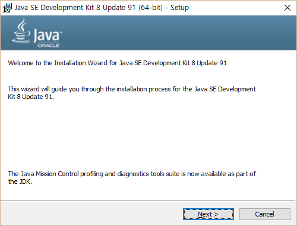
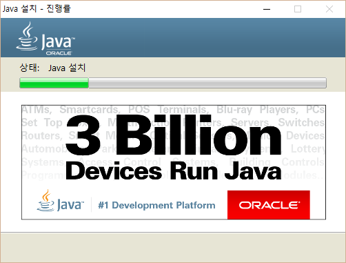
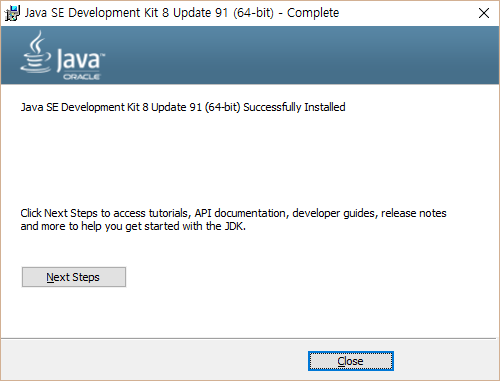

# Android SDK 설치

이 문서는 Android 개발환경의 설치 및 환경설정 과정을 다룹니다.

## 1. JDK 설치
Android SDK는 Java 개발환경을 필요로 합니다.
Android Studio 1.5.x 의 경우 JDK 1.7이상, Android Studio 2.0의 경우 JDK 1.8 이상이 필요합니다. 

### 1. JDK 다운로드

다음은 Oracle의 Java SE Development Kit 8을 다운로드 할 수 있는 링크입니다.
라이선스 동의를 체크 한 후 해당 OS에 맞는 JDK 설치 프로그램을 다운로드 합니다. 

http://www.oracle.com/technetwork/java/javase/downloads/jdk8-downloads-2133151.html

 


### 2. JDK 설치프로그램 실행

설치 프로그램을 실행하여 JDK 설치를 시작합니다.
Next 버튼을 눌러 다음으로 진행 합니다.



### 3. 설치 항목 선택

설치할 JDK 구성요소와 JDK 설치 경로를 선택합니다.
모든 항목이 선택되어있음을 확인하고 Next버튼을 눌러 다음으로 진행합니다.


### 4. 설치 준비

행


### 5. JRE 설치 위치 선택

Java Runtime이 설치될 경로를 지정합니다.
기본 지정된 경로를 확인하고 Next 를 눌러 다음으로 진행합니다.


### 6. 설치 진행 

JDK 가 설치 됩니다. 이 과정은 자동으로 진행됩니다.



### 7. 설치 완료

JDK 설치가 완료되었습니다. Close 버튼을 눌러 설치 프로그램을 종료합니다.



### 8. 설치 확인 

Windows의 명령 프롬프트 또는 OSX나 Linux의 콘솔창에서 ```java -version```을 실행하여
설치한 JDK의 버전이 바르게 표시되는지 확인합니다. 

```
c:\>java -version
java version "1.8.0_91"
Java(TM) SE Runtime Environment (build 1.8.0_91-b14)
Java HotSpot(TM) 64-Bit Server VM (build 25.91-b14, mixed mode)

```